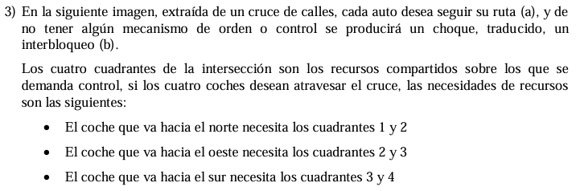

# TP2 - Actividad 3 - Control de Tráfico en Cruce

## Enunciado

**3)** En la siguiente imagen, extraída de un cruce de calles, cada auto desea seguir su ruta (a), y de no tener algún mecanismo de orden o control se producirá un choque, traducido, un interbloqueo (b).

Los cuatro cuadrantes de la intersección son los recursos compartidos sobre los que se demanda control, si los cuatro coches desean atravesar el cruce, las necesidades de recursos son las siguientes:

• El coche que va hacia el norte necesita los cuadrantes 1 y 2
• El coche que va hacia el oeste necesita los cuadrantes 2 y 3  
• El coche que va hacia el sur necesita los cuadrantes 3 y 4
• El coche que va hacia el este necesita los cuadrantes 4 y 1


*(a) Posible interbloqueo - (b) Interbloqueo*

Implemente mediante **pseudocódigo** una rutina que permita la circulación de los autos y evite el interbloqueo, para ello debe emplear semáforos como mecanismo de sincronización, y debe identificar cada auto por el sentido hacia donde desea ir (N, S, E y O).

---

## Análisis del Problema

### Identificación del Problema de Interbloqueo

#### Recursos Compartidos:
Los **4 cuadrantes** de la intersección son recursos críticos que deben ser accedidos de forma exclusiva.

```
    |     |
    |  1  |  2  |
----+-----+-----+----
    |     |     |
    |  4  |  3  |
----+-----+-----+----
    |     |
```

#### Necesidades de Recursos por Dirección:
- **Norte (N)**: Necesita cuadrantes 1 → 2
- **Oeste (O)**: Necesita cuadrantes 2 → 3  
- **Sur (S)**: Necesita cuadrantes 3 → 4
- **Este (E)**: Necesita cuadrantes 4 → 1

#### Condiciones para Interbloqueo:
1. **Exclusión mutua**: Cada cuadrante solo puede ser ocupado por un auto
2. **Retención y espera**: Un auto puede retener un cuadrante mientras espera otro
3. **No apropiación**: Los cuadrantes no pueden ser quitados por fuerza
4. **Espera circular**: N→O→S→E→N (cada uno espera el recurso del siguiente)

---

## Solución 1: Orden de Adquisición de Recursos

### Estrategia: Adquisición Ordenada de Cuadrantes

Para evitar el interbloqueo, todos los autos deben adquirir los cuadrantes en el **mismo orden numérico**.

```pseudocode
// Declaración de semáforos para cada cuadrante
VAR cuadrante1: Semáforo := 1
VAR cuadrante2: Semáforo := 1  
VAR cuadrante3: Semáforo := 1
VAR cuadrante4: Semáforo := 1

PROCEDIMIENTO AutoNorte()
BEGIN
    // Adquirir cuadrantes en orden: 1, 2
    wait(cuadrante1)
    wait(cuadrante2)
    
    // Cruzar la intersección
    ESCRIBIR("Auto Norte: Cruzando cuadrantes 1 → 2")
    DELAY(tiempo_cruce)
    
    // Liberar cuadrantes en orden inverso
    send(cuadrante2)
    send(cuadrante1)
    ESCRIBIR("Auto Norte: Cruce completado")
END

PROCEDIMIENTO AutoOeste()
BEGIN
    // Adquirir cuadrantes en orden: 2, 3
    wait(cuadrante2)
    wait(cuadrante3)
    
    // Cruzar la intersección
    ESCRIBIR("Auto Oeste: Cruzando cuadrantes 2 → 3")
    DELAY(tiempo_cruce)
    
    // Liberar cuadrantes en orden inverso
    send(cuadrante3)
    send(cuadrante2)
    ESCRIBIR("Auto Oeste: Cruce completado")
END

PROCEDIMIENTO AutoSur()
BEGIN
    // Adquirir cuadrantes en orden: 3, 4
    wait(cuadrante3)
    wait(cuadrante4)
    
    // Cruzar la intersección
    ESCRIBIR("Auto Sur: Cruzando cuadrantes 3 → 4")
    DELAY(tiempo_cruce)
    
    // Liberar cuadrantes en orden inverso
    send(cuadrante4)
    send(cuadrante3)
    ESCRIBIR("Auto Sur: Cruce completado")
END

PROCEDIMIENTO AutoEste()
BEGIN
    // Adquirir cuadrantes en orden: 1, 4 (¡ORDEN CAMBIADO!)
    wait(cuadrante1)  // Primero el menor numerado
    wait(cuadrante4)  // Luego el mayor numerado
    
    // Cruzar la intersección
    ESCRIBIR("Auto Este: Cruzando cuadrantes 4 → 1")
    DELAY(tiempo_cruce)
    
    // Liberar cuadrantes en orden inverso
    send(cuadrante4)
    send(cuadrante1)
    ESCRIBIR("Auto Este: Cruce completado")
END
```

### ¿Por qué funciona esta solución?
- **Rompe la espera circular**: Al ordenar la adquisición, eliminamos los ciclos
- **AutoEste** adquiere primero cuadrante1 (no cuadrante4), rompiendo el ciclo
- **Orden global**: 1 < 2 < 3 < 4, todos respetan este orden

---

## Solución 2: Semáforo de Exclusión Mutua Global

### Estrategia: Un Solo Auto en la Intersección

```pseudocode
// Semáforo global para toda la intersección
VAR interseccion: Semáforo := 1

PROCEDIMIENTO AutoNorte()
BEGIN
    wait(interseccion)  // Solo un auto puede estar en la intersección
    
    ESCRIBIR("Auto Norte: Entrando a la intersección")
    ESCRIBIR("Auto Norte: Ocupando cuadrante 1")
    DELAY(tiempo_parcial)
    ESCRIBIR("Auto Norte: Ocupando cuadrante 2")
    DELAY(tiempo_parcial)
    ESCRIBIR("Auto Norte: Saliendo de la intersección")
    
    send(interseccion)  // Liberar la intersección
    ESCRIBIR("Auto Norte: Cruce completado")
END

PROCEDIMIENTO AutoOeste()
BEGIN
    wait(interseccion)
    
    ESCRIBIR("Auto Oeste: Entrando a la intersección")
    ESCRIBIR("Auto Oeste: Ocupando cuadrante 2")
    DELAY(tiempo_parcial)
    ESCRIBIR("Auto Oeste: Ocupando cuadrante 3")
    DELAY(tiempo_parcial)
    ESCRIBIR("Auto Oeste: Saliendo de la intersección")
    
    send(interseccion)
    ESCRIBIR("Auto Oeste: Cruce completado")
END

PROCEDIMIENTO AutoSur()
BEGIN
    wait(interseccion)
    
    ESCRIBIR("Auto Sur: Entrando a la intersección")
    ESCRIBIR("Auto Sur: Ocupando cuadrante 3")
    DELAY(tiempo_parcial)
    ESCRIBIR("Auto Sur: Ocupando cuadrante 4")
    DELAY(tiempo_parcial)
    ESCRIBIR("Auto Sur: Saliendo de la intersección")
    
    send(interseccion)
    ESCRIBIR("Auto Sur: Cruce completado")
END

PROCEDIMIENTO AutoEste()
BEGIN
    wait(interseccion)
    
    ESCRIBIR("Auto Este: Entrando a la intersección")
    ESCRIBIR("Auto Este: Ocupando cuadrante 4")
    DELAY(tiempo_parcial)
    ESCRIBIR("Auto Este: Ocupando cuadrante 1")
    DELAY(tiempo_parcial)
    ESCRIBIR("Auto Este: Saliendo de la intersección")
    
    send(interseccion)
    ESCRIBIR("Auto Este: Cruce completado")
END
```

### Ventajas y Desventajas:
**Ventajas:**
- ✅ **Simple de implementar**
- ✅ **Garantiza ausencia de interbloqueo**
- ✅ **Fácil de entender y mantener**

**Desventajas:**
- ❌ **Menor concurrencia** (solo un auto a la vez)
- ❌ **Menor eficiencia** del tráfico

---

## Solución 3: Control Inteligente con Prioridades

### Estrategia: Detección y Prevención Dinámica

```pseudocode
// Semáforos para cada cuadrante
VAR cuadrante1: Semáforo := 1
VAR cuadrante2: Semáforo := 1
VAR cuadrante3: Semáforo := 1
VAR cuadrante4: Semáforo := 1

// Semáforo para acceso exclusivo al control
VAR control: Semáforo := 1

// Contadores de autos esperando por dirección
VAR esperando_norte: Entero := 0
VAR esperando_oeste: Entero := 0
VAR esperando_sur: Entero := 0
VAR esperando_este: Entero := 0

FUNCIÓN DetectarInterbloquePotencial(): Booleano
BEGIN
    RETORNAR (esperando_norte > 0 AND esperando_oeste > 0 AND 
              esperando_sur > 0 AND esperando_este > 0)
END

PROCEDIMIENTO AutoNorte()
BEGIN
    wait(control)
    esperando_norte := esperando_norte + 1
    
    SI DetectarInterbloquePotencial() ENTONCES
        // Aplicar orden de adquisición
        send(control)
        wait(cuadrante1)
        wait(cuadrante2)
    SINO
        // Adquisición normal
        send(control)
        wait(cuadrante1)
        wait(cuadrante2)
    FIN SI
    
    // Actualizar contador
    wait(control)
    esperando_norte := esperando_norte - 1
    send(control)
    
    // Cruzar
    ESCRIBIR("Auto Norte: Cruzando")
    DELAY(tiempo_cruce)
    
    // Liberar recursos
    send(cuadrante2)
    send(cuadrante1)
END

// Procedimientos similares para AutoOeste(), AutoSur(), AutoEste()
// con sus respectivos contadores y lógica de detección
```

---

## Solución Recomendada: Adquisición Ordenada

### Implementación Completa

```pseudocode
PROGRAMA ControlTrafico

// Declaración de recursos
VAR cuadrante1, cuadrante2, cuadrante3, cuadrante4: Semáforo := 1

PROCEDIMIENTO CruzarInterseccion(direccion: Cadena, cuad1, cuad2: Entero)
VAR sem1, sem2: Semáforo
BEGIN
    // Determinar semáforos en orden numérico
    SI cuad1 < cuad2 ENTONCES
        sem1 := cuadrante[cuad1]
        sem2 := cuadrante[cuad2]
    SINO
        sem1 := cuadrante[cuad2]  
        sem2 := cuadrante[cuad1]
    FIN SI
    
    // Adquirir recursos en orden
    wait(sem1)
    ESCRIBIR(direccion + ": Adquirió primer cuadrante")
    
    wait(sem2)
    ESCRIBIR(direccion + ": Adquirió segundo cuadrante")
    
    // Simular cruce
    ESCRIBIR(direccion + ": Cruzando la intersección...")
    DELAY(tiempo_cruce)
    
    // Liberar recursos en orden inverso
    send(sem2)
    send(sem1)
    ESCRIBIR(direccion + ": Cruce completado")
END

// Procesos para cada dirección
PROCESO AutoNorte
BEGIN
    MIENTRAS verdadero HACER
        DELAY(tiempo_llegada_aleatoria)
        CruzarInterseccion("NORTE", 1, 2)
    FIN MIENTRAS
END

PROCESO AutoOeste  
BEGIN
    MIENTRAS verdadero HACER
        DELAY(tiempo_llegada_aleatoria)
        CruzarInterseccion("OESTE", 2, 3)
    FIN MIENTRAS
END

PROCESO AutoSur
BEGIN
    MIENTRAS verdadero HACER
        DELAY(tiempo_llegada_aleatoria)
        CruzarInterseccion("SUR", 3, 4)
    FIN MIENTRAS
END

PROCESO AutoEste
BEGIN
    MIENTRAS verdadero HACER
        DELAY(tiempo_llegada_aleatoria)
        CruzarInterseccion("ESTE", 1, 4)  // Nota: orden cambiado a 1,4
    FIN MIENTRAS
END

// Programa principal
INICIO
    // Inicializar semáforos
    cuadrante1 := CrearSemáforo(1)
    cuadrante2 := CrearSemáforo(1)  
    cuadrante3 := CrearSemáforo(1)
    cuadrante4 := CrearSemáforo(1)
    
    // Lanzar procesos concurrentes
    LANZAR AutoNorte
    LANZAR AutoOeste
    LANZAR AutoSur
    LANZAR AutoEste
    
    ESCRIBIR("Sistema de control de tráfico iniciado")
    ESCRIBIR("Presione cualquier tecla para terminar...")
    LEER_TECLA()
FIN
```

---

## Análisis de la Solución

### Propiedades Garantizadas:

1. **Ausencia de Interbloqueo**:
   - ✅ Orden global de adquisición de recursos
   - ✅ No hay espera circular posible

2. **Exclusión Mutua**:
   - ✅ Cada cuadrante protegido por semáforo
   - ✅ Solo un auto por cuadrante a la vez

3. **Progreso**:
   - ✅ Los autos eventualmente cruzan
   - ✅ No hay inanición (starvation)

4. **Eficiencia**:
   - ✅ Permite cierta concurrencia
   - ✅ Autos en direcciones no conflictivas pueden cruzar simultáneamente

### Casos de Concurrencia Permitida:

- **Norte y Sur**: Pueden cruzar simultáneamente (usan cuadrantes diferentes)
- **Este y Oeste**: Pueden cruzar simultáneamente (usan cuadrantes diferentes)
- **Combinaciones diagonales**: Posibles bajo ciertas condiciones

### Tabla de Compatibilidad:

| Dirección | Norte | Oeste | Sur | Este |
|-----------|-------|-------|-----|------|
| **Norte** | ❌ | ❌ | ✅ | ❌ |
| **Oeste** | ❌ | ❌ | ❌ | ✅ |
| **Sur** | ✅ | ❌ | ❌ | ❌ |
| **Este** | ❌ | ✅ | ❌ | ❌ |

---

## Conclusiones

### Solución Elegida: **Adquisición Ordenada de Recursos**

**Ventajas:**
- ✅ **Previene interbloqueo** de forma elegante
- ✅ **Permite concurrencia** cuando es segura
- ✅ **Eficiente** en términos de throughput
- ✅ **Escalable** a intersecciones más complejas

**Implementación Clave:**
- Todos los procesos adquieren recursos en **orden numérico ascendente**
- El proceso Este cambia su orden de adquisición de (4,1) a (1,4)
- Esto rompe el ciclo de dependencias y elimina el interbloqueo

**Resultado:**
Un sistema de control de tráfico **libre de interbloqueos** que maximiza la eficiencia del flujo vehicular mientras garantiza la seguridad en la intersección.
